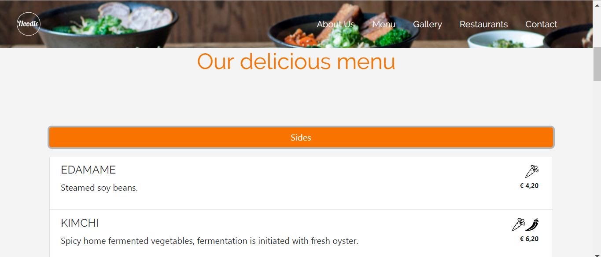
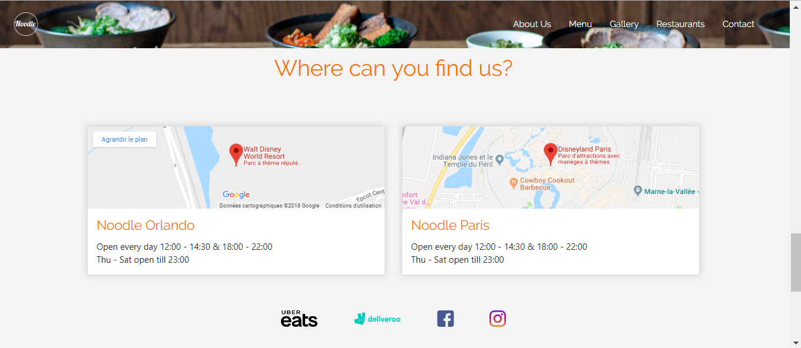

# Noodle-BootStrap
One-Pager pour un restaurant fictif

- **Client** : [Becode](https://github.com/becodeorg/)
- **Où ?** : [Becode](https://github.com/becodeorg/)
- **Quand ?** :  Prairie - BeCode (~ mai 2018), mis à jour octobre 2018
- **Par ?** : 
    - [Marie Cambie](https://github.com/MCambie) 
- **Le site** :  https://mcambie.github.io/Noodle-BootStrap/

## Demande client : 
Le site est un site vitrine d'une franchise de restaurants. La franchise est fictive mais le type de nourriture (burger, pizza, asiatique,...) est laissé au choix de l’apprenant.
Le site doit être responsive : au moins pour les petits écrans (xs) et les écrans moyens (md)
Minimum 5 pages accessibles par une barre de navigation (navbar) présente sur toutes les pages vers les différentes rubriques : Accueil, Carte, Photos, Restaurants, Contact. Si vous souhaitez faire un site plus complet avec encore plus de trucs, faites vous plaisir !       

## Briefing complet : 
Pour le consulter,cliquez [ici](https://github.com/becodeorg/Johnson2/tree/master/projets/Restaurant_Bootstrap)

## Objectif : 
Se familiariser avec la librairie front-end BootStrap.

## Captures d'écrans du projet  :

## Scores lighthouse  :

## Difficultés rencontrées :

Première utilisation de BootStrap
